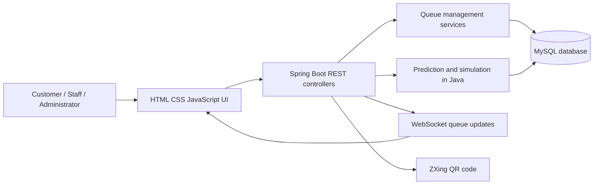
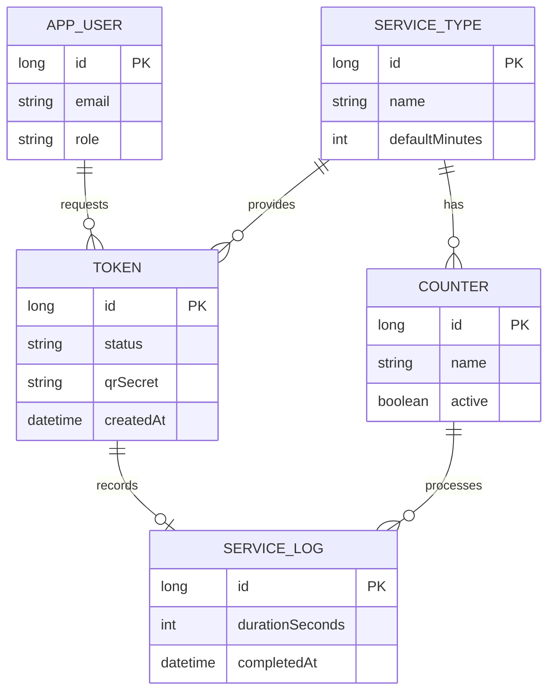

# System architecture

```mermaid
flowchart LR
 U[Customer / Staff / Administrator] --> W[HTML CSS JavaScript UI]
 W --> C[Spring Boot REST controllers]
 C --> S[Queue management services]
 C --> P[Prediction and simulation in Java]
 S --> D[(MySQL database)]
 P --> D
 C --> WS[WebSocket queue updates]
 WS --> W
 C --> Q[ZXing QR code]
```

## Queue lifecycle

`WAITING -> CALLED -> COMPLETED` or `WAITING -> CANCELLED` or `CALLED -> SKIPPED`. QR check-in validates a per-token random secret.

## ER overview

```mermaid
erDiagram
 APP_USER ||--o{ TOKEN : requests
 SERVICE_TYPE ||--o{ TOKEN : provides
 SERVICE_TYPE ||--o{ COUNTER : has
 COUNTER ||--o{ SERVICE_LOG : processes
 TOKEN ||--o| SERVICE_LOG : records
 APP_USER { long id PK string email string role }
 SERVICE_TYPE { long id PK string name int defaultMinutes }
 COUNTER { long id PK string name boolean active }
 TOKEN { long id PK string status string qrSecret datetime createdAt }
 SERVICE_LOG { long id PK int durationSeconds datetime completedAt }
```
